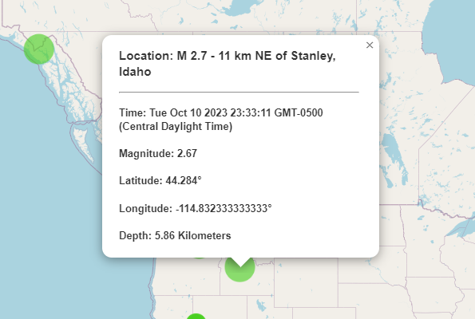

# Using Leaflet to map earthquake locations from USGS data

Contributor: Brian Kath

## Repository Structure

- Main folder
  - README.md
  - index.html
- Sub-folders
  - images
    - earthquake-map.png
    - map-popup.png
  - static
    - css
      - style.css
    - js
      - logic.js

## Overview

For this project, I am using United States Geological Survey(USGS) data on earthquakes to map out all earthquakes recorded within the last 24 hours.

### Data source

The data used for this map is taken from a GeoJSON feed available on the USGS <a href="https://earthquake.usgs.gov/earthquakes/feed/v1.0/geojson.php" target="_blank">GeoJSON Summary Format</a> web page. The specific feed being used is from the link for <a href="https://earthquake.usgs.gov/earthquakes/feed/v1.0/summary/all_day.geojson" target="_blank">All Earthquakes for the Past Day</a>. This feed is updated every minute.

### Data handling

The data is pulled into the logic.js file using a `GET` request with `d3.json`. Using a `for` loop, the time, magnitude, latitude, longitude, and depth of each earthquake is extracted from the data feed and stored in variables.

### Creating the map

The map is created using the Leaflet JavaScript library. A single tile layer using the street map from <a href="https://www.openstreetmap.org/#map=5/38.007/-95.844" target="_blank">openstreetmap.org</a> is used for the background map. The initial view is centered on the coordinates of Salt Lake City, Utah with a zoom of 4, to display the area of the United States with the majority of the earthquake activity.

Within the same `for` loop used to extract the specific data needed for the variables, a circle marker is also created for each earthquake. The location of each marker is based on the earthquake's latitude and longitude. The size and color of the circle markers is based on the magnitude and depth of each earthquake, respectively. Using the `bindPopup` Leaflet function, each marker also has a tooltip displayed when clicking the marker showing the location, time, magnitude, latitude, longitude, and depth of the specific earthquake. Finally, a legend is added to the map showing the color ranges associated with the earthquake depths.

&nbsp;

Below is an image of the resulting map.

The color palette for the earthquake markers and legend colors is from <a href="https://www.color-hex.com/color-palette/56220" target="_blank">color-hex.com.</a> 
The live project is located <a href="https://brnkath.github.io/leaflet-challenge/" target="_blank">here.</a>
